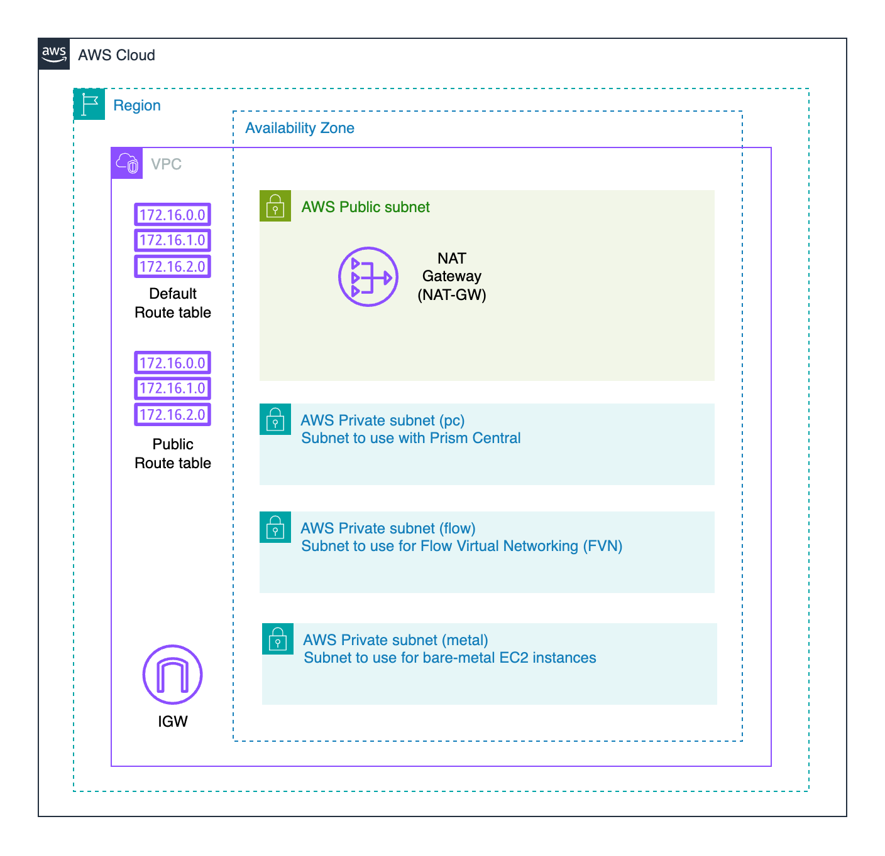

# AWS landing zone for use with NC2

This Terraform configuration creates a VPC network setup for use with Nutanix Cloud Clusters (NC2) with the following features:

- Single VPC with configurable region
- Public and private subnets
- Private subnet internet access via NAT Gateway
- DNS support enabled

## Architecture diagram

This TF sample builds the following components: 



## Configuration Options

### Variables

| Variable | Description | Default |
|----------|-------------|---------|
| project_prefix | Prefix for all resource names | "nc2" |
| vpc_region | Region for VPC | "ap-northeast-1" |
| vpc_cidr | CIDR block for VPC | "10.101.0.0/16" |
| vpc_az | Availability zone for VPC | "ap-northeast-1a" |

### Subnet Structure

The VPC contains:
- 1 public subnet
- 3 private subnets (metal, pc, flow)
- All subnets are /24 CIDR blocks

| Subnet suffix | Description | Type |
|----------|-------------|-------------|
| pc | Subnet for Prism Central | Private |
| metal | EC2 bare-metal server subnet | Private |
| flow | Flow Virtual Networking subnet | Private |
| public | Internet access for cluster | Public |

### Route Tables

- Public subnet: Custom route table with route to Internet Gateway
- Private subnets: Default route table with route to NAT Gateway

## Usage

1. Configure variables in `terraform.tfvars`:
```hcl
project_prefix = "nc2"
vpc_region     = "ap-northeast-1"
vpc_cidr       = "10.101.0.0/16"
vpc_az         = "ap-northeast-1a"
```

2. Initialize and apply:
```bash
terraform init
terraform plan -out nc2.plan
terraform apply nc2.plan
```

## Notes

- Private subnets use the VPC's default route table
- All resources are tagged with the project prefix 

## More info at

Please visit [jonamiki.com](https://jonamiki.com) for more NC2 and AWS info